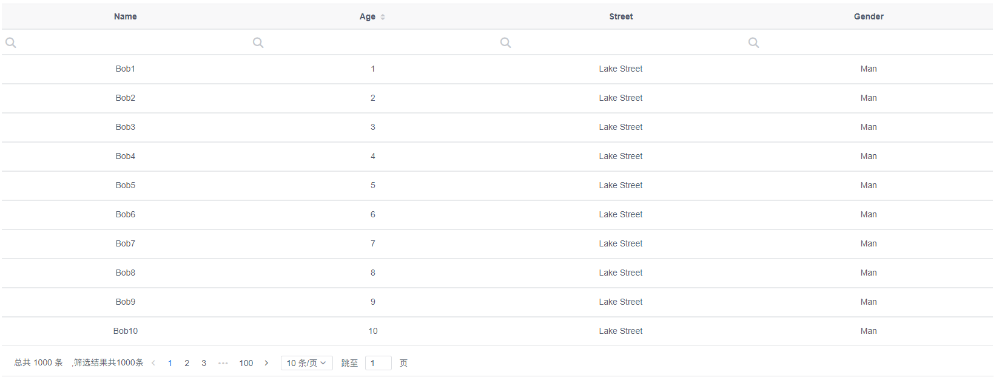
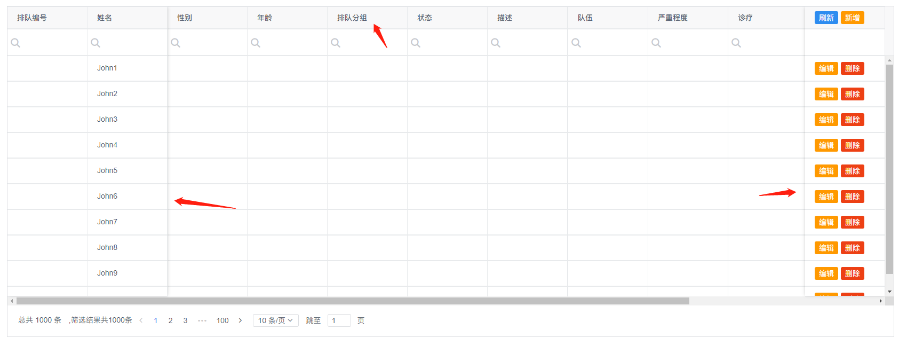

# BeeGridTable [(中文)](./README.zh.md)

#### Description

BeeGridTable , is a Highly Customizable Table UI component library based on Vue.js. Rich functions、More efficient、Easy to use!

#### [Home](http://www.beegridtable.com/index)

http://www.beegridtable.com/index

#### Installation

-   1.  npm

```
npm i beegridtable -S
```

-   2.  Or yarn

```
yarn add beegridtable
```

#### Features

-   Friendly API.
-   Great documentation.
-   It is awesome.
-   Support Vue.js 2.

#### How to use

-   First of all, Import BeeGridTable
    import BeeGridTable in the entry file (main.js as usual) of webpack:

```
import Vue from "vue";
import App from "./App.vue";
import router from "./router";
import store from "./store";

import BeeGridTable from "beegridtable";
import BeeLocale from "beegridtable/src/locale";

import 'beegridtable/dist/styles/beegridtable.css';

Vue.use(BeeGridTable, {
  BeeLocale,
  capture: true,
});

Vue.config.productionTip = false;

new Vue({
  router,
  store,
  render: (h) => h(App),
}).$mount("#app");
```

-   Basic Simple



```
//Vue Template
<BeeGridTable
    :columns="columns"
    :data="data"
></BeeGridTable>

// JS
data() {
    return {
      columns: [
        {
          title: "Name",
          key: "name",
          align: "center",
          resizable: true,
        },
        {
          title: "Age",
          key: "age",
          align: "center",
          sortable: true,
        },
        {
          title: "Street",
          key: "street",
          align: "center",
          resizable: true,
        },
        {
          title: "Gender",
          key: "gender",
          align: "center",
        },
      ],
      data: [],
    };
  },
```

-   Fixed
    

```
//Vue Template
<BeeGridTable
    border
    height="560"
    :showSummary="false"
    :columns="columns"
    :data="data"
>
    <template slot-scope="{ column }" slot="hop">
    <Button type="primary" size="small" style="margin-right: 5px"
        >刷新</Button
    >
    <Button type="warning" size="small" @click="addPatient(column)"
        >新增</Button
    >
    </template>
    <template slot-scope="{ row, index }" slot="op">
    <Button type="warning" size="small" style="margin-right: 5px"
        >编辑</Button
    >
    <Button type="error" size="small" @click="handleDelete(row, index)"
        >删除</Button
    >
    </template>
</BeeGridTable>

//JS
columns: [
    {
        title: "排队编号",
        key: "dialysisNumber",
        fixed: "left",
        width: 150,
        filterHeight: 50,
        resizable: true,
    },
    {
        title: "姓名",
        key: "name",
        fixed: "left",
        width: 150,
        filterHeight: 50,
        resizable: true,
    },
    { title: "性别", key: "sexName", width: 150, resizable: true },
    { title: "年龄", key: "birthDay", width: 150, resizable: true },
    {
        title: "排队分组",
        key: "doctorGroupName",
        width: 150,
        resizable: true,
    },
    {
        title: "状态",
        key: "treatStatusName",
        width: 150,
        resizable: true,
    },
    { title: "描述", key: "diagnosis", width: 150, resizable: true },
    { title: "血管路", key: "bloodRoad", resizable: true },
    { title: "队伍", key: "schedules", width: 150, resizable: true },
    { title: "严重程度", key: "visitTypeName", width: 150, resizable: true },
    { title: "诊疗", key: "termTypeName", width: 150, resizable: true },
    {
        title: "首次冒险",
        key: "firstTreatDate",
        width: 150,
        resizable: true,
    },
    { title: "手机号码", key: "peopleCode", width: 150, resizable: true },
    { title: "证件号", key: "idNumber", width: 150, resizable: true },
    {
        title: "操作",
        slot: "op",
        headSlot: "hop",
        fixed: "right",
        canEdit: false,
        key: "op",
        hideFilter: true,
        resizable: true,
        //   filterHeight: 50,
        width: 150,
    },
    ],
```

#### [More](http://www.beegridtable.com/index)

#### [License MIT](./LICENSE)
